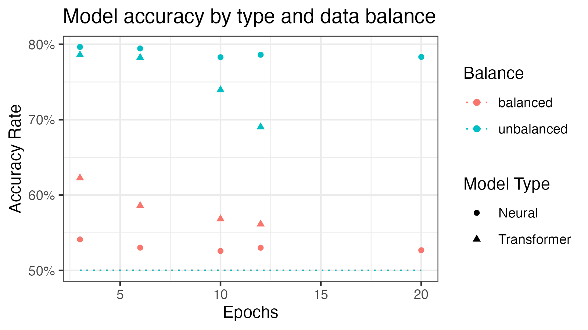

# Classhole: A Natural Language Classifier for the Frustrated Moral Philosopher in All of Us

#### Group members
Declan Bradley, Muriel Moon, Ha Nguyen, Natalie Frank

## Table of Contents
1. [Overview](#overview)
2. [How to run this application on your machine](#run)
3. [Development process](#development)
4. [Analysis](#analysis)
5. [Lessons learned](#lessons)

## Overview 

Welcome! This application is a class project for CSCI 333 Fall 2025 Natural Language Processing taught by Professor Noel Warford. The application classifies posts from the Am I The Asshole (AITA) subreddit. The neural model predicts a NTA/YTA tag for a given input. The unbalanced, 3-epoch neural model's success rate is 79.6%. 

### Structure

The repository is structured as follows:

- model
	- ahole*.keras –– These are our intial models distinguished by number of epochs and trained on balanced or unbalanced data.
 	- transformer*.keras –– These are transformer models.
- notebooks
	- *.ipynb –– Read [Notebooks](#notebooks) below.
- notes
  - chatgpt-help_Keras model prediction function.pdf
  - chatgpt-help_transformer.pdf
- validation-stats
	- model-stats_test-set-full.csv
	- transformer-stats_test-set-10000.csv
- app.py
- index.html
- requirements.txt -- Python libraries used to run the models.
- validation-stats.csv -- Statistics of model accuracy rate.
- model-states_loss_accuracy.csv -- CSV of loss and accuracy values for each model
- model-weights.csv -- Weights for each layer of our best-performing model
- modelsummary.txt -- Summary of layers in our best-performing model

Our small dataset is by [Noah Persaud](https://www.kaggle.com/datasets/noahpersaud/176-million-ramitheasshole-submissions). This dataset is a csv file containing 17767258 posts from r/AITA. For each instance, the 'self_text' attribute contains the text of the post, while the 'link_flair_text' contains the label we are trying to predict (Asshole/Not the Asshole).

### Notebooks

| notebook | description |
| -------- | ----------- |
| data-clean | Reads original dataset from CSV, drops examples not falling into the TA/NTA binary we have chosen to focus on, and performs general data standardization and cleanup tasks. |
| data-format_make-txts | Transforms a pandas dataframe of input data into a directory of txt files, with one txt for each r/AmItheAsshole post in the training data. This format is preferred by the Keras tutorials on which we based our work. |
| model-interface | Development file for the manual_predict and manual_odds functions that we use to interact with our model. These provide a friendly user-facing hook for making predictions directly from a string, and are the basis of our interface app and model validation notebooks. |
| model-train | Trains a neural model from the training data. To maximize our accuracy, we trained different prototype models for each combination of 3, 6, 10, and 12 epochs and balanced vs. unbalanced training data. |
| neural-model-validate | Tests each neural model against a randomly selected sample set of inputs from test data never before seen by the model. Outputs accuracy rates to a CSV file. |
| transformer-train | Trains a transformer model from the training data. To maximize our accuracy, we trained different prototype models for each combination of 3, 6, 10, and 12 epochs and balanced vs. unbalanced training data. |
| transformer-validate | Tests each transformer model against a randomly selected sample set of inputs from test data never before seen by the model. Outputs accuracy rates to a CSV file. |
| validation-cleanup | Combines the validation accuracy rate tables from the two validation notebooks into a single table, cleans it up, and outputs it to `validation-stats.csv` in the main directory. |
|analyze-weights| Loads model file of highest accuracy, returns summary, and outputs csv file of each layer's weights to `model-weights.csv` to main directory.|

## How to run this application on your machine 

Navigate to the project directory in the terminal. Execute `flask run`. This will launch the server app on localhost:5000. (Your localhost address may vary. If so, find http://127.0.0.1:5000/predict?q= in the index.html file and change 5000 to your localhost address.) 

Then, open the project directory in VS Code. Open the index.html file. Install the 'Live Server' extension developed by ritwickdey. Navigate to the bottom right corner and press "Go Live." This will launch the web app on a different branch of the localhost. This is necessary because we cannot point the live GitHub pages site on the web at the localhost app, and we cannot run the app online because we don't have the budget for the memory space needed.

## Development process 

### Steps taken to improve the model

Following our presentation, we noted that the model had a strong tendency to classify any input as Not the *Hole. We observed that our training data also had a strong lean toward NTA, with the vast majority of posts on the original forum receiving that classification. To address this, we sought to balance the dataset by counting the number of TA examples and selecting a random subset of NTA examples of the same length. We retrained variants of all of our models on this new, balanced, dataset. Unfortunately, our validation procedure showed that almost all of these models performed less well than the original models, likely because in the testing data – and the real world – NTA is more likely to be the correct answer in general. 

Additionally, we trained variant models with 3, 6, 10, 12, and 20 epochs, and subjected them all to the same comparative assessment to find out which performed best. Our final model is the unbalanced 3 epoch neural model, with the highest ranked accuracy rate of 79.6%. 

#### Sources used during development
- [Torchtext Primer](https://anie.me/On-Torchtext/)
- [Text Classification with Keras](https://medium.com/@bhuvanav/text-classification-with-neural-networks-using-keras-a-step-by-step-guide-87ee7f1b36a1)
- [Keras: model official documentation](https://keras.io/api/models/model/)
- [Keras: neural model official walkthrough example code](https://keras.io/examples/nlp/text_classification_from_scratch/)
- [Keras: saving and loading a model object](https://keras.io/guides/serialization_and_saving/)
- [Keras: transformer official walkthrough example code](https://keras.io/examples/nlp/text_classification_with_transformer/)
- [Stackoverflow: numpy array bug fixing](https://stackoverflow.com/questions/67183501/setting-an-array-element-with-a-sequence-requested-array-has-an-inhomogeneous-sh)
- ChatGPT debugging chats included under `notes`

## Analysis 

### Accuracy plot

### Accuracy rates of prototype models

For the neural model, **unbalanced 3 epoch neural model** has the highest accuracy with 79.6% on the test set. 
For the transformer model, **unbalanced 3 epoch transformer model** has the highest accuracy with 78.6% on the test set. 

We selected the **unbalanced 3 epoch neural model** as our best prototype and final model.

Model| Balance Type|Epochs|Loss|Accuracy
-----|-------------|------|----|--------
Neural| unbalanced|3|0.4845568537712097|0.7964010238647461
Neural| unbalanced|6|0.5256925821304321|0.7944117188453674
Neural| unbalanced|12|0.741361141204834|0.7861143946647644
Transformer|unbalanced|3|0.5139718055725098|0.7858760356903076
Neural| unbalanced|20|0.9400140643119812|0.7832351922988892
Neural| unbalanced|10|0.582832396030426|0.7827901840209961
Transformer|unbalanced|6|0.5771504044532776|0.7823031544685364
Transformer|unbalanced|10|1.2064696550369265|0.7395333051681519
Transformer|unbalanced|12|2.622164487838745|0.6903375387191772
Transformer|balanced|3|0.6561959385871887|0.6227545142173767
Transformer|balanced|6|0.8934988975524902|0.5859345197677612
Transformer|balanced|10|0.921593964099884|0.5684163570404053
Transformer|balanced|12|2.908616542816162|0.5615046620368958
Neural| balanced|3|0.7374716997146606|0.541198194026947
Neural| balanced|6|0.9213000535964966|0.5302736163139343
Neural| balanced|12|1.5477131605148315|0.5301461815834045
Neural| balanced|20|2.269190788269043|0.5268656015396118
Neural| balanced|10|1.2634562253952026|0.5259101390838623

### Early analysis of parameters

We note that the length of an input seems to matter a great deal to the outcome, with longer examples being much more likely to receive a rating of The A*hole. We hypothesize that this may be representative of the underlying data, as posters who know they are in the wrong may feel pressured to explain and/or justify themselves more.

### Interpretation of Weights

The input embeddings, and each hidden layer have 128 neurons. In the input layer, there are 20000 features with weights and each embedding is 128 dimensions, creating 2,560,000 parameters for layer.

For each hidden layer, there are 128 inputs, 128 neural units, with 7 kernel applications. There are also 128 biases. There are 128 outputs of each layer.

Our output layer has 128 inputs from the previous hidden layer, with 128 weights. there is only one unit because the final prediction is a single probability from 0 to 1. 

For each weight, most values range from -.1 to 0.1. Because weights before training are usually initialized to small, random values, this range of weights could mean that our model is recognizing some patterns(where weights are more extreme), but not using all of the neurons(where weights are near zero). 
Because we had a large number of possible features(20000), it could be that pattern recognition was impaired.
If we were to continue this experiment, we might try constructing models with fewer neurons or input features.

## Lessons learned 

We explored course concepts such as natural language processing (NLP), tokenization, vectorization, data standardization (see [Notebooks](#notebooks)), modern NLP models (implementation of Transformer model), and sentiment analysis. We have achieved the rubric level _E_ by producing a Transformer model that implements the same functionality as our neural model. Additionally, we took steps to optimize our original model, which exceeds our goal of 50% accuracy with a 79.6% success rate on the test data. We documented attempts at better optimization and designed a polished and user-friendly interface. We analyzed our models and made an attempt at interpreting model weights.

